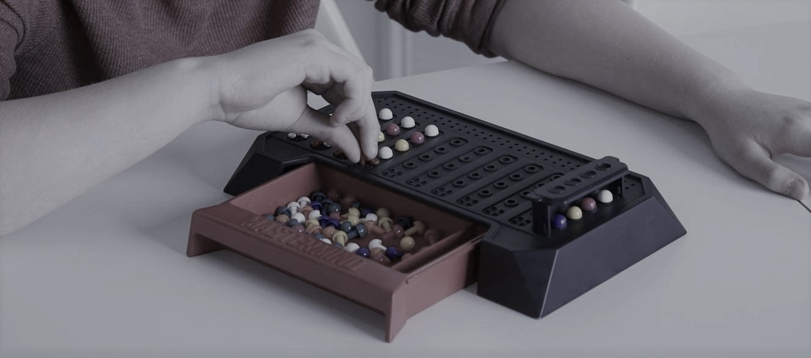

<!-- PROJECT SHIELDS -->

<!-- PROJECT LOGO -->
 

  <h3 align="center"> MasterMind Game🎲</h3>

  

   A "Mastermind" game designed with PyQt5 (Qt+Python)
     
    <a href="https://github.com/RabihND/AP2021-2022-Final"><strong>Explore the documents »</strong></a>
     
     
  

---

<!-- TABLE OF CONTENTS -->

  
Table of Contents
 
  <ol>
    <li><a href="#about-the-project">About The Project</a></li>
    <li><a href="#parts">Parts</a></li>
    <li><a href="#results">Results</a></li>
    <li><a href="#license">License</a></li>
    <li><a href="#refenences">Refenences</a></li>
    <li><a href="#contact">Contact</a></li>
    <li><a href="#roadmap">Roadmap</a></li>
  </ol>

<!-- ABOUT THE PROJECT -->
## About The Project

  
  

<b>Mastermind</b> is a code-breaking game in which two players compete against each other. The game begins when the first participant, dubbed <b>"The Codemaker"</b>, generates a four-digit (color) code that is hidden. The second participant, dubbed <b>"The Codebreaker"</b> then guesses a code.

The codemaker then evaluates the estimate by handing certain black and white pins to the codebreaker (plus and minus in the paper version). The codebreaker guesses another code based on the evaluation, and the game continues until the codebreaker finds (or fails to locate) the concealed code within the maximum number of <b>tries</b>.

(<a href="#top">back to top</a>)

### Built With

Major frameworks/libraries used to this project:

* [Python 3.10](https://www.python.org/)
* [PyQt5](https://www.riverbankcomputing.com/software/pyqt/)

(<a href="#top">back to top</a>)

<!-- PARTS -->
## Parts

(<a href="#top">back to top</a>)

<!-- RESULTS -->
## Results

(<a href="#top">back to top</a>)

<!-- LICENSE -->
## License

(<a href="#top">back to top</a>)

<!-- REFERENCES -->
## Refenences

(<a href="#top">back to top</a>)

<!-- CONTACT -->
## Contacts

Rabih ND - [@RabihND](https://github.com/RabihND) 

Hasan Sanei - [@hasansanei](https://github.com/hasansanei)

**Project Link:** [https://github.com/RabihND/AP2021-2022-Final](https://github.com/RabihND/AP2021-2022-Final)

(<a href="#top">back to top</a>)

<!-- ROADMAP -->
## Roadmap

- [x] Write the main code-map.
- [ ] Design the GUI window. 
- [x] Write the MasterMain Core Functions.
- [ ] ...

(<a href="#top">back to top</a>)

---

<b>
Amirkabir University  of Technology</b>

(Tehran Polytechnic)

